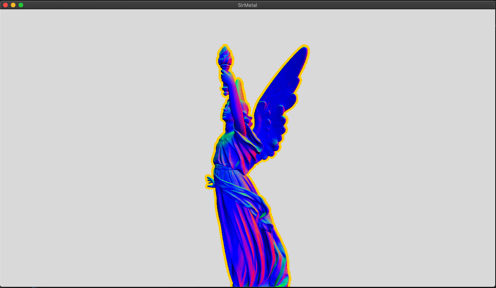
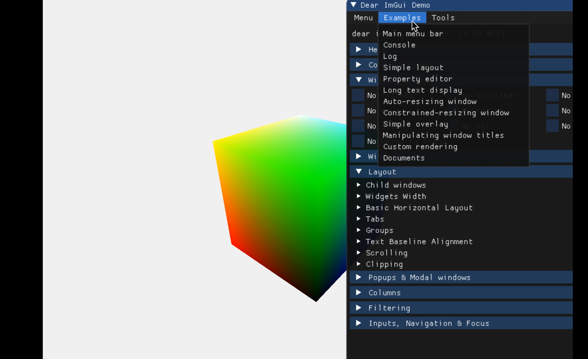
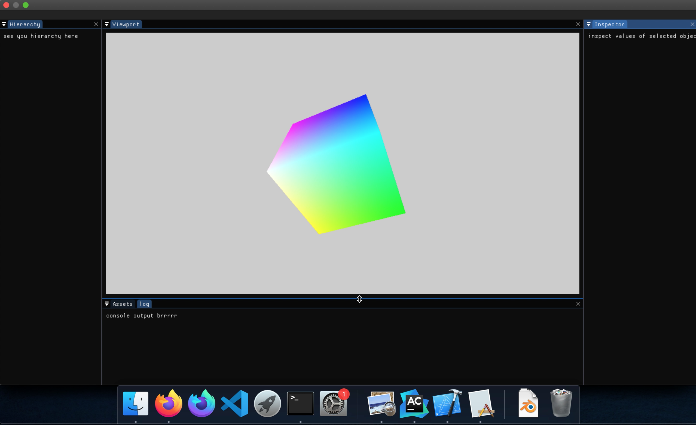
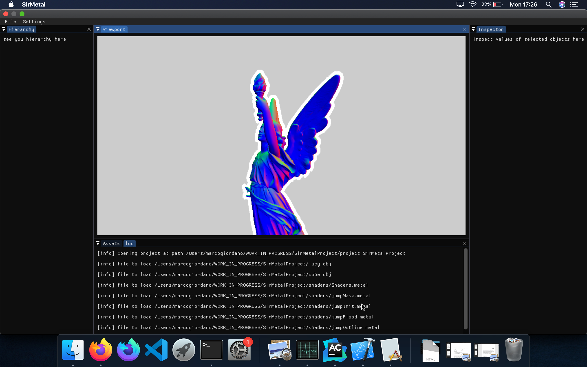

# SirMetal
A metal-based sandbox 

## What is this project
This is a learning sandbox made in C++ and Metal. I try to leverage as much 
as possible the work done in my previous engines to facilitate the work.
The goal should be to achieve a framework easy enough to use to quickly prototype 
and hack techniques together. 

As such one of the goals is to try to create a series of tools you can pick and 
match to do what you want, instead a big heavy "engine", all interconnected where you either 
pick the whole thing or nothing. 

## What this project is not
This is not, and never will be a final product, as mentioned above, is a learning project, 
a sandbox where I try stuff, often in a quick hacky way which I might never clean up. 
Don't take this code as an example of production quality code, 
with the limited time at my disposal I have to pick my battles. 
That does not mean I will partake in bad practices on purpose, 
but at the same time, I won't be striving for cleanness and tidiness as 
I would in production. There will be sharp edges and dark corners, beware.

As such, I won't go to the same great lengths as I did for SirEngine, for example, 
rolling all my own containers and data structure and avoid STL. 
I will be doing whatever makes me work faster. 
If using std::string and std::unordered_map gets me there quicker, so be it. 
If will start to be a speed limitation (I doubt, given the size of the project), 
I will deal with that at the time).

If you find something you don't understand how it works, or think it is bad/wrong/ugly, please feel free to open an issue.
**In particular, help/guidance would be excellent when it comes to Cocoa or objective-c/c++ that is all new stuff for me.**

## Samples
Most samples controls are the common WASD for the camera movement, Q/E for up and down,
finally, left mouse click and drag to pan the camera.

To run, each sample will need to find the necessary data (meshes, shaders ...),
during the build a config.json file should be copied from the same location of the source
to the side of the executable, that json file will contain (among other things) the relative path (from the exec)
to the resource folder.

### Sample list:
- [Jump Flooding Selection](#jump)  

### Jump flooding selection. <a name="jump"/>
This is an implementation of jump flooding algorithm used to generate a thick outline, 
similar to the one you might want to use for a selection in game. 
Inspired by those two great articles:
- https://medium.com/@bgolus/the-quest-for-very-wide-outlines-ba82ed442cd9
- https://blog.demofox.org/2016/02/29/fast-voronoi-diagrams-and-distance-dield-textures-on-the-gpu-with-the-jump-flooding-algorithm/

## What this project used to be!
This project used to be a start of a game editor, but then due to reasons I decided
to pivot and rewrite around a more sample based architecture, the old work is still available
in the branch eidtor if you want to check it out. Here below the old log:

[0.1.0: basic drawing](#v010)  
[0.1.2: basic editor layout](#v012)  
[0.1.4: engine structure and selction shader](#v014)

## 0.1.0 <a name="v010"/>
This version is the hello world.
* Basic cocoa window
* Basic geometry rendering in Metal 
* Imgui
* Dx12 init
* Resize and clear color

## 0.1.2 <a name="v012"/>
Basic editor UI, the first step toward building an editor workflow
* Basic editor UI with docking
* Logging to editor, console and file 
* Loading shaders from file

## 0.1.4 <a name="v014"/>
Developing editor workflow and engine backend systems
* Added the concept of project
* Assets loaded from project folder, for now meshes and shaders
* Loading obj meshes
* Added texture, shader and mesh manager to handle resources through opaque handles
* Added camera controls with settings being loaded and saved with project
* Added jump flooding for creating selection shader
* Added pso hashing to generate required PSOs on the fly if needed, user does not have to worry

