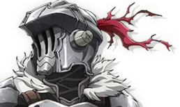

# SirMetal
A metal-based game editor 

## What is this project
This is a learning project to try to write a game editor. In the past, I wrote a lot of engines. For the last two years (on and off) I have been working on SirEngine, my Vulkan and DirectX 12 game engine. That engine is focused on playing pre-baked content, not creating it, is only the runtime of an engine. 

In this project,  I want to focus on the other side of the spectrum, creating an editor. 

I wanted to learn Metal, and did not want to deal with all the sophisticated features of SirEngine; it sounded like a perfect opportunity to create a separate project.
Not having two years worth of code will allow me to easily prototype and trying new things in a much more agile way.

## What this project is not
This is not, and never will be a final product, as mentioned above, is a learning project, a sandbox where I try stuff, often in a quick hacky way which I might never clean up. Don't take this code as an example of production quality code, with the limited time at my disposal I have to pick my battles. That does not mean I will partake in bad practices on purpose, but at the same time, I won't be striving for cleanness and tidiness as I would in production. There will be sharp edges and dark corners, beware.

As such, I won't go to the same great lengths as I did for SirEngine, for example, rolling all my own containers and data structure and avoid STL. I will be doing whatever makes me work faster. If using std::string and std::unordered_map gets me there quicker, so be it. If will start to be a speed limitation (I doubt, given the size of the project), I will deal with that at the time).

If you find something you don't understand how it works, or think it is bad/wrong/ugly, please feel free to open an issue.
**In particular, help/guidance would be excellent when it comes to Cocoa or objective-c/c++ that is all new stuff for me.**

Here I will keep a chronological list of the progress, click on the image to play a video (if an associated one exists):

##### History  
[0.1.0: basic drawing](#v010)  
[0.2.0: basic editor layout](#v020)  
[0.3.0: engine structure and slection shader](#v030)

## 0.1.0 <a name="v010"/>
This version is the hello world.
* Baic cocoa window
* Basic goemetry rendering in metal 
* Imgui
* Dx12 init
* Resize and clear color

## 0.1.2 <a name="v012"/>
Basic editor UI, the first step toward building an editor workflow
* Basic editor UI with docking
* Logging to editor, console and file 
* Loading shaders from file

## 0.1.5 <a name="v012"/>
Developing editor workflow and engine backend systems
* Added concpet of project
* Assets loaded from project folder, for now meshes and shaders
* Loading obj meshes
* Added texture, shader and mesh manager to handle resources through opaque handles
* Added camera controls with settings being loaded and saved with project
* Added jump flooding for creating selection shader
* Added pso hashing to generate required PSOs on the fly if needed, user does not have to worry

